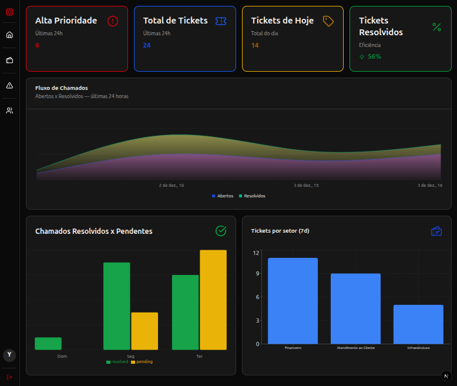

# Help Desk Corp 🛠️


<!--  -->

---

> Sistema de Help Desk para gestão de chamados internos — versão migrada para uma arquitetura moderna com **Next.js + Prisma + Supabase**, preparada para deploy completo na **Vercel**.

---

## Índice

- [Sobre](#sobre)
- [Funcionalidades](#funcionalidades)
- [Perfis de acesso](#perfis-de-acesso)
- [Tecnologias](#tecnologias)
- [O que foi migrado e corrigido](#o-que-foi-migrado-e-corrigido)
- [Pré-requisitos](#pré-requisitos)
- [Como rodar localmente](#como-rodar-localmente)
- [Configuração do Supabase](#configuração-do-supabase)
- [Variáveis de ambiente](#variáveis-de-ambiente)
- [Deploy na Vercel](#deploy-na-vercel)
- [Comandos Prisma](#comandos-prisma)
- [Estrutura do Projeto](#estrutura-do-projeto)
- [Checklist de produção](#checklist-de-produção)
- [Troubleshooting](#troubleshooting)
- [Colaboradores](#colaboradores)
- [Como contribuir](#como-contribuir)
- [Licença](#licença)
- [Autores](#autores)

---

## Sobre

O **Help Desk Corp** é um sistema de gestão de chamados internos voltado para cenários como:

- suporte técnico;
- help desk corporativo;
- atendimento interno universitário;
- controle de solicitações por setor;
- acompanhamento do ciclo de vida de tickets;

Esta versão do projeto representa a **migração completa do backend legado em PHP + MySQL** para uma arquitetura full-stack moderna com:

- **Next.js App Router**;
- **Prisma ORM**;
- **Supabase Postgres**;
- **Supabase Storage**;
- **JWT com cookie HTTP-only**;

O objetivo da migração foi manter a **mesma interface visual e experiência de uso** da aplicação original, trocando apenas a infraestrutura de backend para algo mais robusto, compatível com **deploy 100% online na Vercel** e mais alinhado com práticas atuais de desenvolvimento full-stack.

### Demo: [HelpDesk](https://help-desk-system-jet.vercel.app)

- Usuário comum:
  - user-comum@gmail.com
  - UserCom.123
- Usuário Suporte:
  - user-suporte@gmail.com
  - UserSup.123

---

## Funcionalidades

- ✅ Autenticação de usuários com sessão real via banco de dados
- ✅ Controle de acesso por perfil
- ✅ CRUD de usuários
- ✅ CRUD de chamados
- ✅ Histórico de alterações dos chamados
- ✅ Dashboard com gráficos reais
- ✅ Upload de foto de perfil com Supabase Storage
- ✅ Listagens com filtros, ordenação e paginação
- ✅ Interface responsiva
- ✅ Persistência 100% online com Supabase Postgres
- ✅ Backend integrado ao próprio projeto Next.js
- ✅ Preparado para deploy gratuito na Vercel

---

## Perfis de acesso

| Perfil | Acesso |
|---|---|
| `admin` | Dashboard, chamados, usuários (CRUD), incidentes |
| `suporte` | Dashboard, incidentes, chamados |
| `comum` | Apenas seus próprios chamados |

---

## Tecnologias

Este projeto utiliza as seguintes tecnologias:

- **Frontend**
  - Next.js 16
  - React 19
  - TypeScript
  - Tailwind CSS 4
  - shadcn/ui
  - TanStack Table
  - Recharts
  - React Hook Form
  - SWR
  - Sonner

- **Backend**
  - Next.js App Router
  - Route Handlers
  - Prisma ORM
  - Zod
  - JWT
  - bcryptjs

- **Banco e storage**
  - Supabase Postgres
  - Supabase Storage

- **Deploy**
  - Vercel

---

## O que foi migrado e corrigido

### Backend legado removido

O backend antigo em **PHP + MySQL** foi substituído por **Route Handlers do Next.js**, centralizando frontend e backend no mesmo projeto.

| Backend antigo (PHP) | Backend novo (Next.js) |
|---|---|
| `routes/auth/login.php` | `src/app/api/auth/login/route.ts` |
| `routes/auth/change_password.php` | `src/app/api/auth/change-password/route.ts` |
| `routes/chamados/read_all.php` | `GET /api/chamados` |
| `routes/chamados/insert.php` | `POST /api/chamados` |
| `routes/chamados/edit.php` | `PUT /api/chamados/[id]` |
| `routes/chamados/delete.php` | `DELETE /api/chamados/[id]` |
| `routes/chamados/getUser.php` | `GET /api/chamados/user/[id]` |
| `routes/usuarios/read.php` | `GET /api/usuarios` |
| `routes/usuarios/create_user.php` | `POST /api/usuarios/create` |
| `routes/usuarios/insert.php` | `POST /api/usuarios/register` |
| `routes/usuarios/edit.php` | `PUT /api/usuarios/[id]` |
| `routes/usuarios/delete.php` | `DELETE /api/usuarios/[id]` |
| `routes/usuarios/upload_photo.php` | `POST /api/usuarios/upload-photo` |

### Problemas corrigidos na migração

- ✅ **Login mockado removido**  
  Antes havia autenticação simulada com usuário hardcoded. Agora o login usa banco real com Prisma + bcrypt.

- ✅ **Sessão em localStorage removida**  
  Agora a sessão usa **cookie HTTP-only**, mais seguro e compatível com SSR.

- ✅ **Schema legado inconsistente corrigido**  
  O SQL antigo tinha referências inconsistentes entre nomes no singular e plural. O `schema.prisma` foi padronizado corretamente.

- ✅ **Upload local de fotos removido**  
  O antigo filesystem local foi substituído por **Supabase Storage**, compatível com Vercel.

- ✅ **Dados hardcoded no perfil removidos**  
  A página de perfil agora lê os dados reais do usuário autenticado.

- ✅ **Integração do frontend com API interna**  
  O frontend deixou de depender do backend PHP externo e passou a consumir apenas as rotas internas do próprio app.

### Visual preservado

A migração foi feita com foco em **não alterar a interface visual**:

- mesmas páginas;
- mesmas rotas;
- mesmos componentes;
- mesmo layout;
- mesmas classes CSS/Tailwind;
- mesma UX geral;

---

## Pré-requisitos

> Antes de rodar o projeto localmente, certifique-se de ter instalado:

- Node.js
- npm
- conta no Supabase
- projeto criado no Supabase
- banco configurado com as variáveis de ambiente

> Recomendado: usar uma versão estável do Node compatível com o projeto.

---

## Como rodar localmente

### 1. Clonar o repositório

```bash
git clone https://github.com/tenmenezes/HelpDesk-System.git
cd HelpDesk-System
